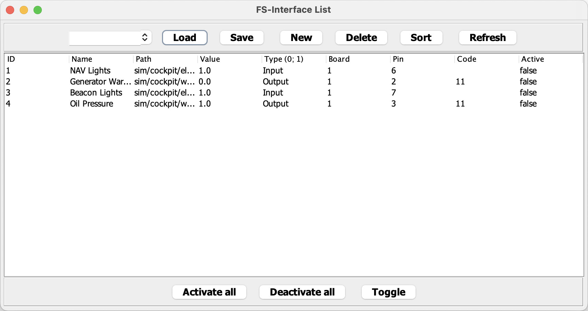

# FS-Interface

> An interface with GUI to connect a microcontroller to a flight simulator.

## Table of Contents

* [Introduction](#introduction)
* [Features](#features)
* [Screenshots](#screenshots)
* [Dependencies](#dependencies)
* [Usage](#usage)
* [Acknowledgements](#acknowledgements)

## Introduction

- Interface switches, buttons, annunciations, ... between the simulator and a home cockpit
- Communication is realized using the UDP and COM protocols
    - UDP on simulator side
    - COM on microcontroller side
- Information exchange with so called *datarefs* of the simulator
- Tested with X-Plane 11 and an Arduino Uno/Nano

## Features

- Compatible with any COM supported microcontroller
- Compatible with any flight simulator
- Compatible with any plane type
- Creation of configuration templates for different planes

## Screenshots

*Controller frame*

*Template frame*

## Dependencies

- [ini4j](https://github.com/facebookarchive/ini4j)
- [ardulink (v1)](https://github.com/Ardulink/Ardulink-1)
- [ardulink (v2)](https://github.com/Ardulink/Ardulink-2)

## Usage

- Run the `FS-Interface.jar` file
- Select a template file in the template frame and click `Load`
- Set the *IP, Ports and Baud-Rate* in the control frame
- Start both connections by clicking `Connect`
- Activate both connections by clicking `Activate`
- Change the delays as needed

## Acknowledgements

This project was inspired by myself, since there was no alternative.

*Original idea in May 2019*
