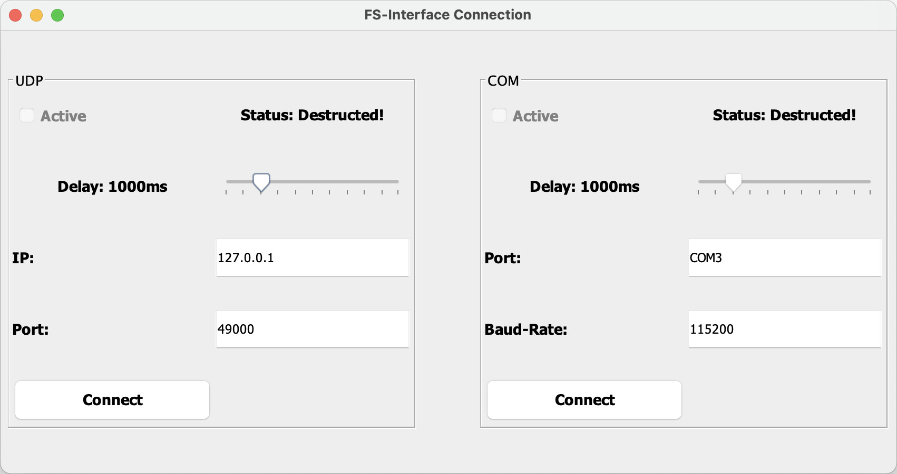
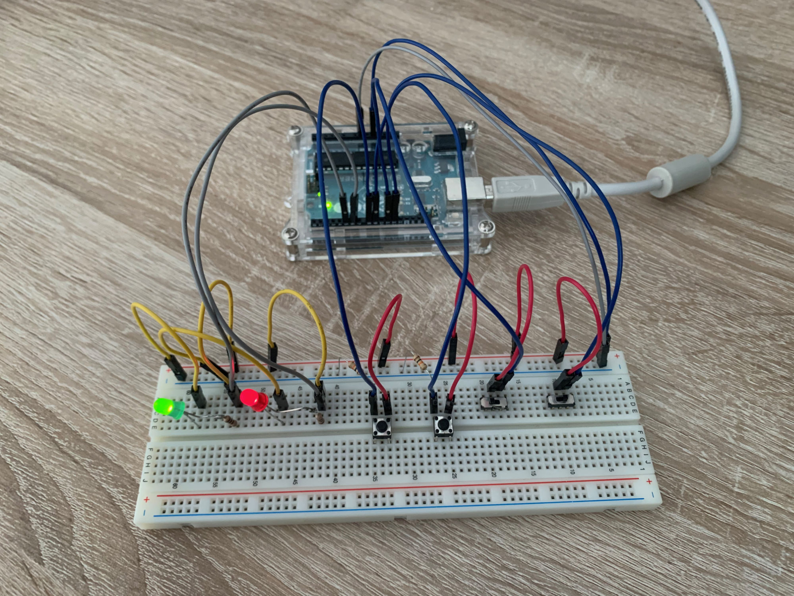
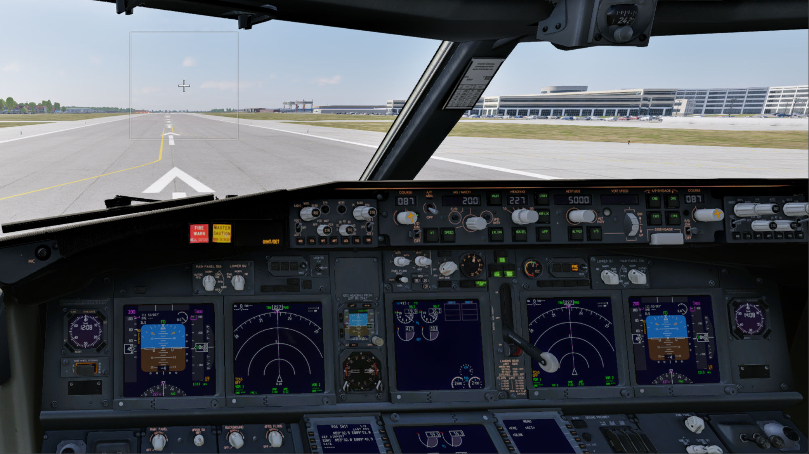

# FS-Interface

Small desktop bridge that connects a flight simulator (UDP) with a microcontroller (COM).

## Overview

This app is a bridge for switches, buttons, annunciations and other cockpit hardware. It uses UDP on the simulator side and COM on the microcontroller side, exchanging simulator values via *datarefs*. The current implementation was tested with X-Plane 11 and Arduino Uno/Nano.

## How It Works

- **Templates** map simulator *datarefs* to pins of microcontroller.
- **UDP** handles simulator input/output (X-Plane *dataref* protocol).
- **COM** handles microcontroller input/output (Arduino USB connection).
- **GUI** provides two windows.
    - **Connection window:** configure UDP/COM settings and start/stop.
    - **List window:** load/edit templates and activate features.

## Project Structure

- `config/` Sample template files
- `lib/` Third‑party libraries
- `src/` Application source code

## Dependencies

- [ini4j](https://github.com/facebookarchive/ini4j)
- [ardulink (v1)](https://github.com/Ardulink/Ardulink-1)
- [ardulink (v2)](https://github.com/Ardulink/Ardulink-2)

## Screenshots

### Control window

### Template window

### Arduino Setup

### Simulator Setup

## Usage

1. Run the `FS-Interface.jar` file.
2. Select a template file in the list window and click `Load`. Alternatively, create a new template file and save it.
3. Set the *IP, Ports and Baud-Rate* in the connection window.
4. Start both connections by clicking `Connect`.
5. Activate both connections by clicking `Activate`.
6. Change the delays as needed.

## Notes

- Template files live in `./config/` relative to the `FS-Interface.jar`. Keep the folder name as‑is to avoid breaking loading/saving.
