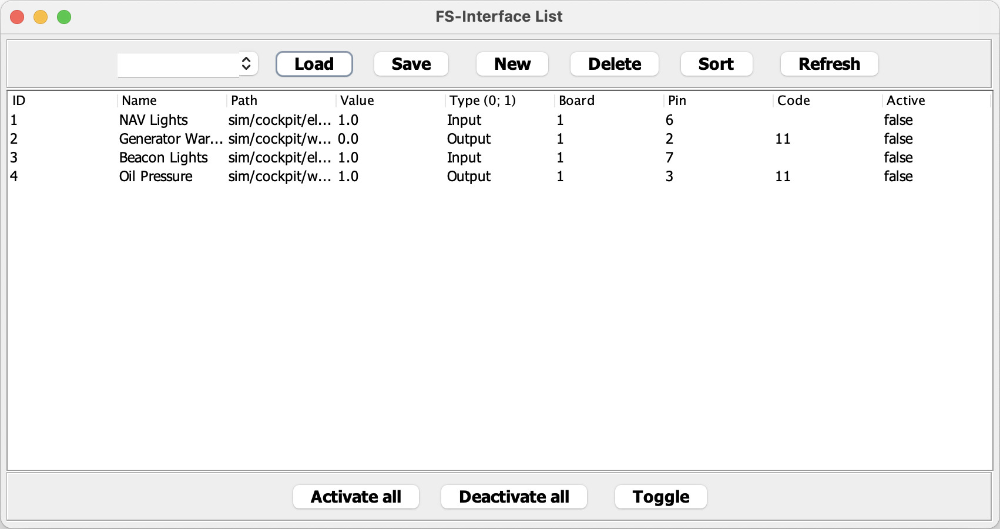

# FS-Interface

> An universal interface between flight simulators and microcontroller.

## Table of Contents

* [Introduction](#introduction)
* [Features](#features)
* [Screenshots](#screenshots)
* [Dependencies](#dependencies)
* [Usage](#usage)
* [Acknowledgements](#acknowledgements)

## Introduction

- This tool interfaces switches, buttons, annunciations, etc. between a flight simulator and home cockpit.
- Communication is realized using the UDP and COM protocols.
    - UDP on simulator side
    - COM on microcontroller side
- Information exchange with so called *datarefs* provided by the simulator.
- Tested with X-Plane 11 and an Arduino Uno/Nano.

## Features

- Compatible with any COM supported microcontroller
- Compatible with any UDP supported flight simulator
- Compatible with any plane type
- Creation of configuration templates for different planes

## Screenshots

 
*Controller frame*

 
*Template frame*

## Dependencies

- [ini4j](https://github.com/facebookarchive/ini4j)
- [ardulink (v1)](https://github.com/Ardulink/Ardulink-1)
- [ardulink (v2)](https://github.com/Ardulink/Ardulink-2)

## Usage

- Run the `FS-Interface.jar` file.
- Select a template file in the template frame and click `Load`.
- Alternatively create a new template file and save it.
- Set the *IP, Ports and Baud-Rate* in the control frame.
- Start both connections by clicking `Connect`.
- Activate both connections by clicking `Activate`.
- Change the delays as needed.

## Acknowledgements

This project was inspired by myself, since there was no suitable alternative.

*Original idea in May 2019*
